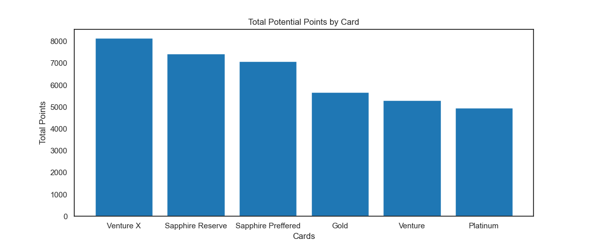

# What Credit Card should I pick next?

I have gotten into the credit card points wave by recently getting the AMEX gold card. In this project, I wanted to use my past spending to help determine which card I should go for next.

 * In this analysis I didn't include the factors of a welcome bonus and annual fee
 * Strictly looking into my spending and which card offers the best points return

# About the Data
 I started by getting my statement from my American Express Gold card I currently have. These are purchases I have made over the past month and a half. The main two data points I focused on were the amount spent and the category of the purchases. That file isn't in the repository as it has private information. The second CSV has the different credit cards I wanted to test, annual fees, and multipliers on the most common categories. 

 # Process
1. I started by important necessary libraries, creating DataFrames with the CVS's and condensing them down into only the data needed. 
2. The next step I took was calculating the amount I spent in each category. I created a dictionary where the key was the category and the value was the total amount paid. 
3. From there I made a dictionary for the cards and points. The key was the card and the value was total points. I created a function to calculate the points-taking card, amount(for the category), and multiplier for that category. I was then adding those points to the respective card. 

# Conclusion

There are so many factors that play into deciding which credit card is best for you. In this analysis, I was able to find out that the Venture X card by Capital One when strictly looking at my spending was the best for points. This card offers a high multiplier on flights and hotels. I currently have domestic round-trip domestic flights and two-night stay booked. These purchases take up a majority of the overall spending I have made. 

What does this mean for my decision in the future? I am considering either Venture X or Sapphire Preferred because a card with more travel benefits would complement my current credit card stack nicely.

Find me on X: brado_cards

By the slim chance you are reading this and are interested, here in my referral link to the Amex Gold card:

Apply for an American Express Card with this link. With your new Card, you could earn a welcome bonus and your friend could earn a referral bonus. Terms Apply. https://americanexpress.com/en-us/referral/gold-card?ref=BRADELFXiy&xl=cp01

